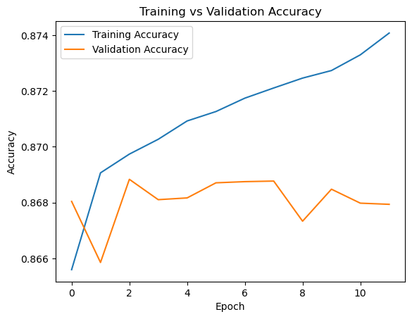
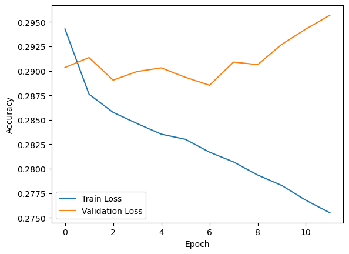
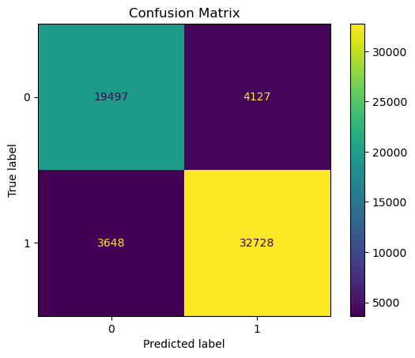

# Student Pass/Fail Prediction Using Neural Network

## 📌 Project Overview

This project uses a **Neural Network** to predict whether a student will **Pass or Fail** based on academic, study, and lifestyle-related factors.

The project demonstrates a complete Machine Learning workflow, including data preprocessing, feature encoding, feature scaling, Neural Network development, model training, validation, EarlyStopping, and final evaluation.

## 🎯 Objective

The main objective is to build a binary classification model that can predict a student's outcome:

* **0 → Fail**
* **1 → Pass**

## 📊 Dataset Features

The dataset contains the following features:

* Age
* Study Hours
* Attendance
* Sleep Hours
* Previous Grade
* Assignments Completed
* Practice Tests Taken
* Group Study Hours
* Notes Quality Score
* Time Management Score
* Motivation Level
* Mental Health Score
* Screen Time
* Social Media Hours

### Target Variable

The target variable is the student's **Pass/Fail** outcome.

## 🧹 Data Preprocessing

The dataset was prepared before training the Neural Network.

The preprocessing steps included:

1. Handling categorical variables through encoding.
2. Separating input features and target variable.
3. Feature scaling for numerical data.
4. Splitting the data into training and testing sets.
5. Creating a validation dataset from the training data.

### Data Leakage Prevention

`final_grade` and `grade_category` were removed from the input features because they are directly related to the student's final outcome and could introduce **data leakage**, resulting in unrealistically high model performance.

## 🧠 Neural Network

A **Sequential Neural Network** was developed using TensorFlow/Keras.

The model uses:

* Input layer
* Dense hidden layers
* ReLU activation functions
* Sigmoid output layer for binary classification

The Sigmoid output produces a probability between 0 and 1, which is converted into a Pass/Fail prediction using a threshold of 0.5.

## ⚙️ Model Compilation

The model was compiled using:

* **Optimizer:** Adam
* **Loss Function:** Binary Crossentropy
* **Evaluation Metric:** Accuracy

## ⏱️ EarlyStopping

The model was trained with the **EarlyStopping** callback.

EarlyStopping monitors validation performance during training and stops training when the model stops improving.

The best model weights are restored using:

```python
restore_best_weights=True
```

This helps prevent unnecessary training and reduces the risk of overfitting.

## 📈 Model Evaluation

The final model was evaluated on the unseen test dataset using:

* Accuracy
* Loss
* Precision
* Recall
* F1-score
* Classification Report
* Confusion Matrix

## 📊 Results

The final Neural Network achieved approximately:

**Test Accuracy: 87%**

The model showed reasonably balanced performance across both Pass and Fail classes.

## 🛠️ Technologies Used

* Python
* Pandas
* NumPy
* Scikit-learn
* TensorFlow
* Keras
* Matplotlib
* Jupyter Notebook

## 📁 Project Structure

```text
student-pass-fail-neural-network/
│
├── README.md
├── requirements.txt
└── student_pass_fail.ipynb
```

## 🚀 How to Run

### 1. Clone the repository

```bash
git clone <repository-url>
```

### 2. Install dependencies

```bash
pip install -r requirements.txt
```

### 3. Open the notebook

Open:

```text
student_pass_fail.ipynb
```

using Jupyter Notebook, JupyterLab, or Google Colab.

## 📚 Key Learnings

Through this project, I learned:

* Data preprocessing for Neural Networks
* Categorical encoding
* Feature scaling
* Building Neural Networks with Keras
* Binary classification
* Training and validation
* EarlyStopping
* Selecting the best epoch
* Model evaluation
* Classification reports
* Confusion matrices
* Preventing data leakage

## ✅ Conclusion

This project demonstrates the complete workflow of developing a Neural Network for a binary classification problem. The model achieved approximately **87% test accuracy** and showed similar training, validation, and testing performance, indicating that the model generalizes reasonably well to unseen data.

## 📈 Model Performance

### Training vs Validation Accuracy



### Training vs Validation Loss



### Confusion Matrix


